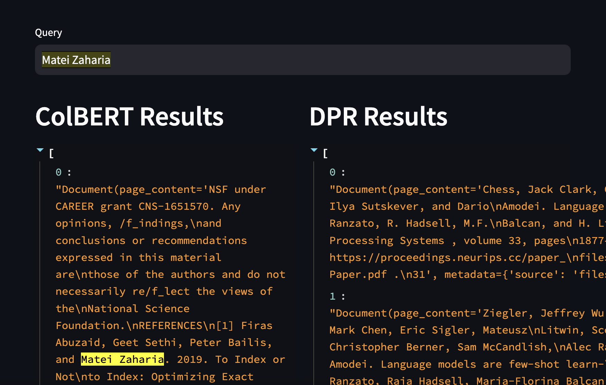

### ColBERT on Astra DB

Demo of ColBERT full retrieval in Astra DB and [RAGStack](https://www.datastax.com/products/ragstack)

Inspired from @jbellis [colbert-astra](https://github.com/jbellis/colbert-astra) project

Uses AstraDB's [Data API](https://docs.datastax.com/en/astra/astra-db-vector/api-reference/data-api.html) and `langchain` style for data loading and semantic search.

#### Get started

Initial Setup 

- Download [pretrained BERT checkpoint](https://downloads.cs.stanford.edu/nlp/data/colbert/colbertv2/colbertv2.0.tar.gz) and untar it to this folder.

- Add any PDFs you want to load to `files` folder

- `pip install -r requirements.txt`

- `python3 run load.py`

- `.env`

```
OPENAI_API_KEY=
ASTRA_DB_API_ENDPOINT=
ASTRA_DB_APPLICATION_TOKEN=
```
Query Interface

- `streamlit run app.py`



#### How it works

For ColBERT style retrieval, data is stored in 2 Astra DB collections

`interactions` - for storing the content of individual chunks

```
{
    "content": "text data",
    "part": "chunk_id",
    "metadata": {
        "source": "filename",
        "page": 1
    }
}
```

`interactions_bert` - for storing contextualized BERT embeddings for individual tokens in a chunk
```
{
    "_id": "df837eab-a779-4afa-b1ff-45e6874b593b",
    "part": "15",
    "token": "15",
    "$vector": [...],
    "metadata": {
        "source": "filename",
        "page": 1
    }
}
``` 

Query time:

- for a input query `q`, get the query vectors `qv`
- for every query vector v in qv, find ANN from `interactions_bert`
- compute `score` - sum of maximum similarity for all `v` in `qv` with respect to retrieved `$vector` for each part

```
    def maxsim(qv, document_embeddings):
        return max(qv @ dv for dv in document_embeddings)

    def score(query_embeddings, document_embeddings):
        return sum(maxsim(qv, document_embeddings) for qv in query_embeddings)
```
- sort the `score`, now retrieve the `content` - actual chunk data from `interactions` collection base on `part` ordered by `score` - most relevant chunks for the given query.

#### Langchain style

Langchain style makes it easier for developers to get started without worrying about the internal implementation details of ColBERT 

```
from colbert_vectorstore import Astra_ColBERT_VectorStore
import os 

colbert_vstore = Astra_ColBERT_VectorStore(    
        collection_name="interactions",
        token=os.environ["ASTRA_DB_APPLICATION_TOKEN"],
        api_endpoint=os.environ["ASTRA_DB_API_ENDPOINT"],
    )

texts = ["hello world", "cat is sitting on a wall", "dog is running"]

colbert_vstore.add_texts(texts)

results = colbert_vstore.similarity_search('is there a cat?')
```

#### References
- [Overcoming the Limits of RAG with ColBERT](https://thenewstack.io/overcoming-the-limits-of-rag-with-colbert/)

- [colbert-astra](https://github.com/jbellis/colbert-astra)

- [ColBERT Paper](https://arxiv.org/abs/2004.12832)

- [RAGStack](https://www.datastax.com/products/ragstack)

- [AstraDB](https://www.datastax.com/products/datastax-astra)

- [Langchain](https://python.langchain.com/docs/integrations/vectorstores/astradb)

#### License
Apache License 2.0
